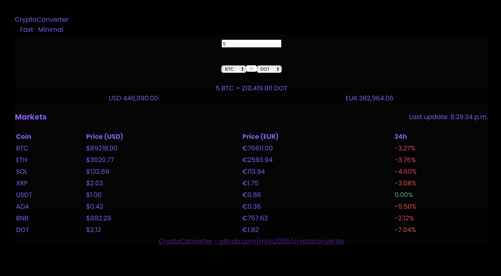

# CryptoConverter

A small, focused single-page React app (Vite + Tailwind) for converting cryptocurrencies and viewing a live market list.

This README explains what the project contains, how it works, and step-by-step instructions to run it locally and build it for production.

---

## Quick summary

- Tech: React + Vite, Tailwind CSS, PostCSS
- Live-pricing: CoinCap WebSocket (USD realtime) + CoinGecko REST (EUR & 24h change)
- UI: Dark, purple/violet theme with a compact converter and a market table

This project was iteratively developed in a small workspace. The codebase includes a simple hook `usePrices` which combines REST and WebSocket sources so prices update frequently.

## Features

- Crypto → Crypto converter with USD/EUR equivalents
- Market table with prices (USD/EUR) and 24h change
- Near-real-time USD updates via WebSocket + periodic REST fallback
- Minimal, dark, violet-styled UI with responsive layout

## Repo layout (high level)

- `index.html` — app entry and favicon links
- `src/main.jsx` — React entry
- `src/App.jsx` — main layout (Header, converter, MarketTicker)
- `src/components/` — UI components (Header, MarketTicker, CryptoPairConverter, CryptoSelector, etc.)
- `src/hooks/usePrices.js` — price fetching hook (CoinGecko REST + CoinCap WS)
- `src/index.css` & `src/App.css` — global styles + fallbacks
- `tailwind.config.js` — Tailwind theme (colors, fonts)
- `postcss.config.js` — PostCSS plugins (must use `@tailwindcss/postcss` for this setup)
- `public/` — static assets served at root (favicon or `swaplogo.png`)

If you build, production assets appear in `dist/`.

## How it works — architecture & data flow

1. On mount, the `usePrices` hook performs an initial REST fetch against CoinGecko to obtain:
   - USD and EUR prices
   - 24h percent change for each asset

2. The hook opens a WebSocket to CoinCap that streams USD price updates for a set of assets. When a WS message arrives the hook updates only the `usd` value for the corresponding symbol, preserving the `eur` and `usd_24h_change` fields previously fetched.

3. A periodic REST polling runs as a fallback (configurable in the hook). In this project the hook is configured to poll every 5 seconds so the UI remains up-to-date even where WebSocket cannot be established.

4. The hook exposes { prices, loading, lastUpdated }:
   - `prices`: object keyed by symbol (BTC, ETH, SOL, ...). Each entry contains at least `usd` and `eur` and may include `usd_24h_change` when available.
   - `loading`: boolean, initial loading state
   - `lastUpdated`: timestamp of the last successful update (REST or WS)

The UI consumes this hook to render conversion results and the market table.

## Local development — step by step

Requirements
- Node.js (v16+ recommended) and npm

1. Clone the repo

```bash
git clone https://github.com/mhc2005/cryptoconverter.git
cd cryptoconverter
```

2. Install dependencies

```bash
npm install
```

3. Run the dev server

```bash
npm run dev
```

Open http://localhost:5173 in your browser. The app uses Vite's dev server and supports HMR.

4. Build for production

```bash
npm run build
```

5. Preview a production build locally

```bash
npm run preview
```

## Favicon / logo notes

- The project references a logo at `/swaplogo.png` and includes a fallback `public/favicon.svg`. If you want your own image, place `swaplogo.png` or `favicon.svg` in the `public/` folder so it is served at `/swaplogo.png` or `/favicon.svg`.
- Browsers aggressively cache favicons — if you change it and don’t see updates, try a hard refresh or open a private window.

## Important config notes (tooling gotchas)

- PostCSS/Tailwind plugin: recent Tailwind setups require a dedicated PostCSS plugin. This project uses `@tailwindcss/postcss` in `postcss.config.js`. If you copy the config elsewhere, ensure that package is installed.
- `tailwind.config.js` is exported as CommonJS to avoid some tooling quirks — if you migrate, be mindful of ESM vs CommonJS.
- Avoid using `@apply` at top-level in some setups — if PostCSS fails, move global utility usage to a regular CSS rule and add fallbacks in `src/App.css`.

## Troubleshooting

- If prices do not update:
  - Open the browser DevTools → Network and look for requests to `api.coingecko.com` (should occur at the polling interval).
  - Check Console for WebSocket errors (CoinCap) or CORS failures.
  - If WebSocket is blocked in your environment (corporate networks, older browsers), the REST fallback will still update prices according to the polling interval.

- If the UI shows “Loading...” forever:
  - Ensure the app can reach CoinGecko (network, CORS). The hook now clears `loading` if REST fails, but the first successful fetch is still required to populate EUR/24h.

- Rate limits / heavy polling:
  - Polling every 5 seconds increases request volume to CoinGecko. If you hit rate limits, increase the interval (e.g., 15s or 30s) in `src/hooks/usePrices.js`.

## Dev notes & possible improvements

- Add an on-screen connection indicator (WS connected / disconnected).
- Implement exponential backoff for WS reconnection.
- Make the polling interval configurable via environment variables.
- Add unit tests for the hook using mocking for REST and WS.

## Where to look in the code

- `src/hooks/usePrices.js` — main logic for REST + WS + fallback polling
- `src/components/CryptoPairConverter.jsx` — converter UI and swap behavior
- `src/components/MarketTicker.jsx` — the market table and place where `lastUpdated` is displayed
- `src/components/Header.jsx` — top-left title and small header styles
- `src/App.css` — additional custom CSS and fallbacks for theme; some visual borders were removed here in the current theme

## License & contact

This repo does not include an explicit license file. If you'd like to open-source it, consider adding an `LICENSE` (MIT is common for small projects).

If you want further help (move favicon into `public/`, make polling configurable, or add a WS status indicator), tell me which improvement you prefer and I can implement it.

---

Thanks for building this — the code is intentionally small and easy to iterate on. If you'd like, I can also add a short CONTRIBUTING section or a one-click script to start the app and open the browser.

## Planned improvements & future additions

Below are a couple of practical enhancements that could be added in the future:

1. Wallet integration and on-chain balances
  - Integrate popular wallet providers (e.g., MetaMask, WalletConnect) to allow users to connect their wallets and display on-chain balances for each supported cryptocurrency. This would enable a live portfolio view and make the converter more personalized.

2. Dedicated coin pages with real-time charts
  - Add per-coin pages that open when a user clicks a coin in the market table. Each page would show an interactive, real-time price chart (driven by WebSocket feeds), historical data, key market metrics, and related links or news.

If anyone is interested in contributing, please feel free to propose changes, improvements, or implementations — contributions and suggestions are always welcome.

# React + Vite

This template provides a minimal setup to get React working in Vite with HMR and some ESLint rules.

Currently, two official plugins are available:

- [@vitejs/plugin-react](https://github.com/vitejs/vite-plugin-react/blob/main/packages/plugin-react) uses [Babel](https://babeljs.io/) (or [oxc](https://oxc.rs) when used in [rolldown-vite](https://vite.dev/guide/rolldown)) for Fast Refresh
- [@vitejs/plugin-react-swc](https://github.com/vitejs/vite-plugin-react/blob/main/packages/plugin-react-swc) uses [SWC](https://swc.rs/) for Fast Refresh

## React Compiler

The React Compiler is not enabled on this template because of its impact on dev & build performances. To add it, see [this documentation](https://react.dev/learn/react-compiler/installation).

## Expanding the ESLint configuration

If you are developing a production application, we recommend using TypeScript with type-aware lint rules enabled. Check out the [TS template](https://github.com/vitejs/vite/tree/main/packages/create-vite/template-react-ts) for information on how to integrate TypeScript and [`typescript-eslint`](https://typescript-eslint.io) in your project.

## Example of app in production



